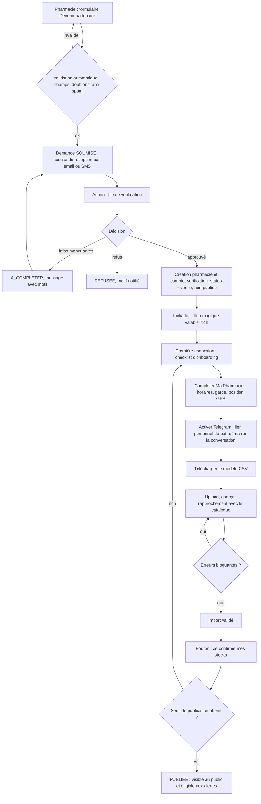
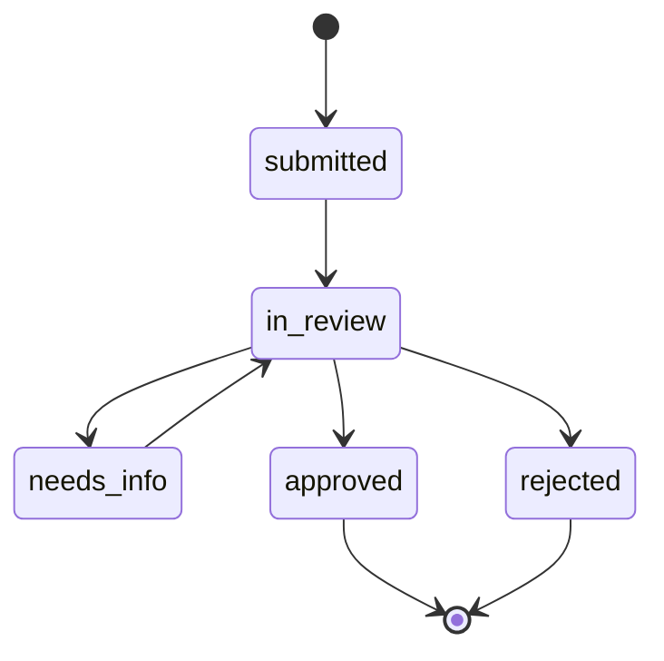

# SPEC 1 — Parcours d'onboarding des pharmacies partenaires

> **Destinataire : Claude Code.** Document à lire en entier avant d'écrire du code.
> Projet : N'Gola Pharma (Yaoundé). Cible : de « pharmacie inconnue » à « pharmacie publiée avec stocks frais ».
> Spec liée : `SPEC-2-routage-alertes.md` (service de notifications, `pharmacy_contacts`).
>
> **Décisions du propriétaire intégrées (v2)** : (1) canal principal **Telegram** à la place de WhatsApp (activation par lien personnel du bot) ; (2) médicaments **restreints** validés par un pharmacien, jamais routés automatiquement ; (3) **ordonnances** présentées en pharmacie lors de l'achat ou du retrait, jamais collectées par la plateforme ; (4) **MVP et présentation aux pharmaciens** : catalogue de test en **mode démo** (SPEC 2, section 4.0bis ; section 5ter ci-dessous). Le dépôt Git `Ngola-pharma` existe déjà : travailler en branches et PR.

---

## 0. Consignes à Claude Code

1. **Inspecte d'abord le dépôt** : schéma actuel (tables pharmacies, stocks, alertes), structure frontend, API. La stack cible supposée est : frontend HTML/CSS/JS vanilla sur Netlify, API Node.js/Express (Fly.io), Supabase (PostgreSQL + Auth + RLS). **Si le dépôt diffère, adapte-toi au dépôt, pas à cette hypothèse.**
2. Pas de framework frontend ajouté. Pas de réécriture de l'existant : migrations incrémentales, rétro-compatibles.
3. Toute écriture en base passe par des **migrations SQL versionnées**. Le SQL ci-dessous est un **modèle cible** : fusionne-le avec les tables existantes (ne crée pas de doublons).
4. Tests obligatoires pour la logique métier (statuts, rapprochement catalogue, validation d'import).
5. En dev, aucun envoi réel de message : utiliser un fournisseur `console/mock` (voir SPEC 2).
6. Textes UI en **français** (clés i18n FR/EN, l'EN peut rester à traduire).
7. Livrer par petites PR dans l'ordre de la section 9.

### Correctifs préalables (P0, avant toute fonctionnalité)
Constatés sur l'Espace Pro actuel :
- « Ma Pharmacie » affiche **`[object Object]`** pour les horaires → formater l'objet JSON (ex. « Lun–Sam 08:00–20:00 »).
- Le statut s'affiche en valeur brute **`non_verifie`** → libellé « Non vérifiée » + badge.
- Compteur « Médicaments en stock » = 16 alors que 13 disponibles + 3 en rupture → renommer « Médicaments référencés ».
- Doublon **Coartem 20/120mg** (5 400 « En stock » et 5 100 « Rupture ») → contrainte d'unicité (section 6) et champ conditionnement.
- Latitude/longitude en chiffres bruts → mini-carte avec repère déplaçable (Google Maps déjà intégré).

---

## 1. Acteurs et statuts

| Acteur | Rôle |
|---|---|
| Responsable d'officine | Remplit la pré-inscription, gère stocks/prix/horaires |
| Admin / Reviewer | Vérifie les dossiers, active les comptes, gère le catalogue |
| Système | Notifications, relances, rapprochement catalogue |

**Deux statuts distincts à ne pas confondre :**

- `applications.status` : `submitted` → `in_review` → `needs_info` | `rejected` | `approved`
- `pharmacies.verification_status` (existant, valeurs historiques conservées) : `non_verifie` | `verifie` | `suspendu`
- `pharmacies.is_published` (booléen) : visible sur le site public et éligible au routage d'alertes.

**Règle de publication (configurable)** : une pharmacie est publiée si `verification_status='verifie'` **et** `onboarding_checklist` complète **et** au moins `min_fresh_items` (défaut **10**) médicaments confirmés depuis moins de 7 jours.

---

## 2. Parcours (vue d'ensemble)





---

## 3. Étape A — Pré-inscription (page publique `/devenir-partenaire`)

**Champs obligatoires**
- Nom de l'officine, quartier (liste fermée des quartiers existants), adresse en texte libre, téléphone fixe de l'officine.
- Pharmacien titulaire : nom complet, **numéro d'inscription à l'Ordre**, email, numéro de téléphone mobile (format E.164, ex. `+2376XXXXXXXX`, utilisé pour les SMS de repli et le rappel de vérification).
- Position GPS : bouton « Utiliser ma position » + repère déplaçable sur carte (facultatif mais recommandé).
- Horaires d'ouverture (grille par jour) et participation à la garde (oui/non).
- Consentements cochés séparément : conditions d'usage ; réception des demandes de patients par Telegram/SMS/email (opt-in, horodaté). **Telegram ne peut pas être activé à ce stade** (le bot ne peut écrire qu'après un `/start` de la personne) : l'activation se fait à l'étape C.

**Justificatifs** (upload PDF/JPG/PNG, 5 Mo max chacun) :
- Attestation d'inscription à l'Ordre des Pharmaciens du Cameroun. *Obligatoire.*
- Autorisation d'ouverture/d'exploitation de l'officine. *Obligatoire.*
- Pièce d'identité du titulaire : **facultative par défaut** (minimisation des données ; à trancher avec un conseil juridique local).
- Fichiers dans un **bucket privé**, jamais d'URL publique ; accès admin via URL signée de 5 minutes.

**Contrôles automatiques à la soumission**
- Anti-spam : Turnstile/hCaptcha + limite de 3 demandes par IP et par jour.
- Détection de doublon : même téléphone, même numéro d'Ordre, nom normalisé identique dans le même quartier, ou GPS à moins de 30 m d'une pharmacie existante → la demande est créée mais **marquée `duplicate_suspect`** pour l'admin.
- Numéros E.164 valides (libphonenumber), email valide.

**Sortie** : `applications.status='submitted'` ; accusé de réception par email (et SMS) `onboarding_recu` ; événement d'audit.

---

## 4. Étape B — Vérification (console admin)

**Écran « Demandes »** : liste filtrable (statut, ancienneté, doublons suspects), SLA affiché (**cible : 48 h ouvrées**), pastille rouge au-delà.

**Checklist de vérification** (cases à cocher, chacune horodatée et attribuée au reviewer) :
1. Numéro d'Ordre cohérent avec le nom du titulaire et l'attestation.
2. Autorisation d'exploitation lisible et valide.
3. **Rappel téléphonique** au numéro fixe de l'officine (le numéro doit répondre et confirmer le nom de l'officine).
4. Adresse et GPS cohérents sur la carte.
5. Aucun doublon avec une pharmacie existante.

**Décisions**
- **Approuver** → transaction unique : création/liaison de la `pharmacy` (`verification_status='verifie'`, `is_published=false`), création du compte Supabase Auth, génération du lien magique (72 h), envoi `onboarding_approuve` (avec lien), événement d'audit.
- **Demander des compléments** (`needs_info`) → motif obligatoire (liste prédéfinie + texte libre), message `onboarding_complements`, la pharmacie répond via un lien signé (pas de compte requis).
- **Refuser** → motif obligatoire, message `onboarding_refuse`. Pas de suppression des données avant 90 jours.

**Création en masse (pharmacies existantes, les 52 actuelles)** : import CSV admin (`nom, quartier, adresse, telephone, latitude, longitude, titulaire, numero_ordre, email, telephone_mobile`), tout est créé en `non_verifie` et non publié ; l'admin vérifie ensuite une par une. Aucune pharmacie ne passe `verifie` sans checklist complète.

---

## 5. Étape C — Activation et premier import (Espace Pro)

**Checklist d'onboarding** affichée en haut de l'Espace Pro tant que la pharmacie n'est pas publiée (barre de progression) :

| # | Tâche | Critère de complétion |
|---|---|---|
| 1 | Définir le mot de passe | Compte actif |
| 2 | Compléter « Ma Pharmacie » | Horaires renseignés, position GPS confirmée |
| 3 | Activer Telegram | Ouverture du lien personnel/QR code du bot et `/start` reçu (`pharmacy_contacts.verified_at`) ; jusqu'à 3 agents peuvent activer le leur. Option « Je n'utilise pas Telegram » : SMS + Espace Pro seulement, avec avertissement de réactivité moindre |
| 4 | Importer mes stocks | Au moins 1 import validé |
| 5 | Confirmer mes stocks | Bouton « Je confirme mes stocks » pressé |
| 6 | Seuil de publication | ≥ `min_fresh_items` médicaments frais |

### 5.1 Import CSV/Excel (remplace l'écran actuel)

1. **Modèle téléchargeable** (CSV et XLSX) avec colonnes `nom, dosage, conditionnement, prix, en_stock` et 3 lignes d'exemple ; colonnes obligatoires : `nom`, `prix`.
2. **Lecture tolérante** : séparateur `,` ou `;` (Excel FR), encodage UTF-8 ou Windows-1252, prix du type `5 400`, `5400 FCFA`, `5.400`, valeurs `en_stock` : oui/non/yes/no/1/0/vrai/faux. Limites : 5 000 lignes, 5 Mo.
3. **Rapprochement avec le catalogue** (ligne par ligne) :
   - normalisation (minuscules, sans accents ni ponctuation, unités `mg`, `ml`, `g` uniformisées) ;
   - alias exact → confiance 1,0 ;
   - similarité trigramme (`pg_trgm`) ≥ 0,80 → suggestion pré-sélectionnée ; 0,50–0,79 → **à confirmer** ; < 0,50 → **non reconnu** (bouton « Demander l'ajout au catalogue », crée une `catalog_requests`).
4. **Écran d'aperçu** avant écriture, ligne par ligne : ✅ reconnu, ⚠️ à confirmer, ❌ erreur. Filtres par état. L'utilisateur corrige/choisit le médicament dans une liste (nom + dosage + forme + conditionnement).
5. **Règles de validation**
   - Bloquant : prix absent, non numérique, ≤ 0 ou > 500 000 ; médicament non rapproché (la ligne est ignorée, pas bloquante pour le lot).
   - Avertissement : prix écartant de plus de 50 % la médiane des autres pharmacies (si ≥ 5 pharmacies ont ce produit) ; ligne en doublon dans le fichier (la dernière l'emporte).
6. **Mode** : « Mettre à jour » (défaut : ne touche pas aux produits absents du fichier) ou « Remplacer tout mon stock » (confirmation explicite, les absents passent en archivé).
7. **Validation** : transaction unique ; chaque ligne écrite met `last_confirmed_at = now()`.
8. **Annulation** : bouton « Annuler cet import » pendant 24 h (restaure l'état précédent via `import_rows.prev_value`).
9. **Historique** des imports (date, fichier, lignes créées/mises à jour/ignorées, auteur).

### 5.2 Après le premier import
- Bouton permanent « **Je confirme mes stocks aujourd'hui** » dans « Mes Stocks » : met à jour `last_confirmed_at` des lignes inchangées en un clic.
- Colonne « Dernière MAJ » colorée : vert ≤ 3 j, orange ≤ 7 j, rouge > 7 j.

### 5.3 Relances automatiques (service de notifications)
- Si non publiée après l'approbation : rappels à **J+1, J+3, J+7** (`onboarding_rappel`), avec lien direct vers l'étape bloquante ; au-delà de 30 jours, statut `dormante` et alerte à l'admin (aucune suppression).

---

## 5bis. Classification réglementaire du catalogue (nouveau)

- Chaque médicament du catalogue porte trois champs : `requires_prescription` (information affichée « sur ordonnance »), `restricted` (stupéfiants, psychotropes) et `classification_validated_at`.
- **Migration des lignes existantes** : les médicaments du **catalogue de test** sont marqués `is_demo=true` ; leur `restricted` est fixé par le propriétaire via `seed/demo_catalog.csv` (SPEC 2, 4.0bis), jamais par Claude Code. Tout autre médicament, et tout médicament ajouté plus tard, passe à `restricted=true` et `classification_validated_at=null` (comportement sûr). En **production**, le routage automatique n'est possible qu'après validation par un **pharmacien** via l'écran admin « Classification du catalogue » (SPEC 2, 4.0).
- **Claude Code ne décide pas des classifications** : il fournit l'écran, la table de validation et les contrôles ; le contenu vient du pharmacien validateur.
- **Ordonnances** : aucun champ, aucun upload, aucun statut de vérification d'ordonnance dans la plateforme. Le site public et l'Espace Pro affichent seulement le badge « Sur ordonnance » et la mention « à présenter à la pharmacie lors de l'achat ou du retrait ».
- Dans l'import de stocks (5.1), un médicament rapproché avec `restricted=true` est importé normalement dans le stock de la pharmacie, mais **n'est jamais utilisé par le routage automatique**. Son affichage public est un point à trancher (section 11).

---

## 5ter. Mode démo (MVP et présentation aux pharmaciens)

- Le produit tourne en `app_mode='demo'` jusqu'au lancement (voir SPEC 2, 4.0bis : routage sur catalogue de test, liste blanche d'envois réels, statut `suppressed_demo`, bannière, script de remise à zéro).
- **Onboarding en démo** : la pré-inscription, la file de vérification, la checklist et l'import CSV fonctionnent avec des **données fictives** ; aucune pièce justificative réelle n'est demandée (message d'avertissement sur le formulaire). Le parcours peut être rejoué de bout en bout devant les pharmaciens avec une demande fictive.
- **Les 52 pharmacies de test** restent `is_demo=true`, sans contact réel. Une pharmacie qui participe à la présentation crée son propre contact Telegram (activation par lien) ; seul ce contact est marqué `is_demo_contact=true`.
- **Sortie de démo** : voir la liste de contrôle « Passage en production » (SPEC 2, 4.0bis). Les lignes `is_demo` sont archivées ou purgées, jamais mélangées aux vraies pharmacies publiées.

---

## 6. Modèle de données (cible)

```sql
-- Extensions
create extension if not exists pg_trgm;

-- Demandes de pré-inscription
create table applications (
  id uuid primary key default gen_random_uuid(),
  status text not null default 'submitted'
    check (status in ('submitted','in_review','needs_info','rejected','approved')),
  pharmacy_name text not null,
  quartier_id uuid not null,
  address text not null,
  landline text not null,
  owner_name text not null,
  order_number text not null,         -- numéro d'inscription à l'Ordre
  owner_email text not null,
  owner_phone text not null,          -- E.164 (SMS, rappel de vérification)
  lat numeric(9,6), lng numeric(9,6),
  opening_hours jsonb not null,
  on_call_participant boolean not null default false,
  consent_terms_at timestamptz not null,
  consent_messaging_at timestamptz not null,
  duplicate_suspect boolean not null default false,
  reviewer_id uuid,
  decision_reason text,
  pharmacy_id uuid,                   -- renseigné à l'approbation
  created_at timestamptz not null default now(),
  decided_at timestamptz
);

create table application_documents (
  id uuid primary key default gen_random_uuid(),
  application_id uuid not null references applications(id) on delete cascade,
  kind text not null check (kind in ('ordre_attestation','autorisation_exploitation','id_titulaire','autre')),
  storage_path text not null,         -- bucket privé
  uploaded_at timestamptz not null default now()
);

create table application_checklist (
  application_id uuid references applications(id) on delete cascade,
  item text check (item in ('ordre_ok','autorisation_ok','rappel_tel_ok','adresse_gps_ok','pas_doublon')),
  checked_by uuid not null, checked_at timestamptz not null default now(),
  primary key (application_id, item)
);

-- Extension de la table existante pharmacies (adapter aux colonnes déjà présentes)
alter table pharmacies
  add column if not exists is_published boolean not null default false,
  add column if not exists onboarding_state jsonb not null default '{}',
  add column if not exists published_at timestamptz,
  add column if not exists is_demo boolean not null default false;   -- les 52 pharmacies de test

-- Canaux de contact (partagé avec SPEC 2)
create table pharmacy_contacts (
  id uuid primary key default gen_random_uuid(),
  pharmacy_id uuid not null references pharmacies(id) on delete cascade,
  channel text not null check (channel in ('telegram','sms','email')),
  address text not null,              -- chat_id Telegram, E.164 ou email
  is_primary boolean not null default false,
  opt_in_at timestamptz not null,
  verified_at timestamptz,
  opted_out_at timestamptz,
  is_demo_contact boolean not null default false,   -- liste blanche des envois réels en mode démo
  unique (pharmacy_id, channel, address)
);

-- Catalogue de référence
create table drug_catalog (
  id uuid primary key default gen_random_uuid(),
  dci text not null,
  brand_name text,
  strength text,                      -- ex. '500mg', '20/120mg'
  form text,                          -- comprimé, sirop, gélule...
  pack_size text,                     -- ex. 'boîte de 6', 'boîte de 24'
  requires_prescription boolean not null default false,  -- information : ordonnance présentée en pharmacie
  restricted boolean not null default true,              -- stupéfiants/psychotropes : jamais routé automatiquement (SPEC 2, 4.0)
  classification_validated_at timestamptz,               -- nul = traité comme restreint (comportement sûr)
  is_demo boolean not null default false,                -- catalogue de test (mode démo)
  classification_validation_id uuid,                     -- -> catalog_classification_validations (SPEC 2)
  status text not null default 'active',
  unique (dci, brand_name, strength, form, pack_size)
);
create table drug_aliases (
  alias_normalized text not null,
  catalog_id uuid not null references drug_catalog(id) on delete cascade,
  primary key (alias_normalized, catalog_id)
);
create index on drug_aliases using gin (alias_normalized gin_trgm_ops);
create table catalog_requests (
  id uuid primary key default gen_random_uuid(),
  pharmacy_id uuid not null, raw_name text not null, raw_strength text,
  status text not null default 'open', created_at timestamptz not null default now()
);

-- Stocks (fusionner avec la table existante ; ajouter l'unicité qui évite le doublon Coartem)
create table stock_items (
  id uuid primary key default gen_random_uuid(),
  pharmacy_id uuid not null references pharmacies(id) on delete cascade,
  catalog_id uuid not null references drug_catalog(id),
  price_fcfa integer not null check (price_fcfa > 0),
  status text not null default 'in_stock' check (status in ('in_stock','low','out','archived')),
  last_confirmed_at timestamptz not null default now(),
  updated_by uuid,
  unique (pharmacy_id, catalog_id)
);

-- Imports
create table import_batches (
  id uuid primary key default gen_random_uuid(),
  pharmacy_id uuid not null, uploaded_by uuid not null, filename text not null,
  mode text not null check (mode in ('merge','replace')),
  status text not null default 'parsed'
    check (status in ('parsed','previewed','committed','rolled_back','failed')),
  counts jsonb not null default '{}',
  created_at timestamptz not null default now(), committed_at timestamptz
);
create table import_rows (
  batch_id uuid not null references import_batches(id) on delete cascade,
  row_number int not null,
  raw jsonb not null,
  matched_catalog_id uuid,
  match_confidence numeric(3,2),
  match_method text check (match_method in ('alias','trigram','manual','none')),
  issues jsonb not null default '[]',
  resolution text check (resolution in ('accepted','skipped','mapped_manually')),
  prev_value jsonb,                   -- pour l'annulation
  primary key (batch_id, row_number)
);

-- Journal d'audit (toutes les décisions et changements sensibles)
create table onboarding_events (
  id bigint generated always as identity primary key,
  application_id uuid, pharmacy_id uuid,
  actor_id uuid, actor_type text not null check (actor_type in ('pharmacy','admin','system')),
  event text not null, details jsonb not null default '{}',
  created_at timestamptz not null default now()
);
```

**RLS (Supabase)**
- Un utilisateur pharmacie ne lit/écrit que les lignes de **sa** `pharmacy_id` (stocks, import_batches, import_rows, pharmacy_contacts).
- `applications`, `application_documents`, `application_checklist`, `onboarding_events` : réservés au rôle `admin`/`reviewer` (la pré-inscription publique passe par une route API serveur, jamais d'écriture directe anonyme).
- Champs sensibles de `pharmacies` (nom, adresse, n° d'Ordre, GPS, verification_status) : **non modifiables** par la pharmacie ; elle soumet une `change_request` validée par l'admin.
- `drug_catalog` : lecture pour les pharmacies, écriture admin seulement.

---

## 7. API (indicatif)

| Méthode | Route | Accès |
|---|---|---|
| POST | `/api/applications` | Public (captcha, rate limit) |
| POST | `/api/applications/:id/documents` | Public (jeton de la demande) |
| GET | `/api/admin/applications` | Admin |
| POST | `/api/admin/applications/:id/{approve,reject,request-info}` | Admin |
| POST | `/api/admin/pharmacies/bulk-import` | Admin |
| GET | `/api/pro/onboarding` | Pharmacie (état de la checklist) |
| POST | `/api/pro/contacts/telegram-link` | Pharmacie (génère le lien/QR code personnel, jeton à usage unique, 72 h) |
| POST | `/api/webhooks/telegram` | Telegram (SPEC 2) : traite `/start <token>` et active le contact |
| GET | `/api/pro/import/template?format=csv|xlsx` | Pharmacie |
| POST | `/api/pro/import` | Pharmacie (upload → parse → `import_batches`) |
| GET/PATCH | `/api/pro/import/:batchId/rows` | Pharmacie (aperçu, corrections) |
| POST | `/api/pro/import/:batchId/{commit,rollback}` | Pharmacie |
| POST | `/api/pro/stocks/confirm-all` | Pharmacie |

---

## 8. Messages d'onboarding (via le service de notifications de la SPEC 2)

Clés de messages : `onboarding_recu`, `onboarding_complements`, `onboarding_approuve`, `onboarding_refuse`, `onboarding_rappel`, `telegram_activation` (SPEC 2). Canaux : **email + SMS avant l'activation de Telegram** (le bot ne peut pas écrire en premier), puis Telegram une fois activé ; email systématique pour `onboarding_approuve` et `onboarding_refuse`. Les textes sont à rédiger dans le même format que ceux de la SPEC 2 (court, sans promesse de délai ferme, pas de données personnelles dans le corps du message hors prénom/nom d'officine).

---

## 9. Ordre de livraison conseillé

0. **Dépôt** — Créer une branche par PR (`feat/pr0-correctifs`, `feat/pr1-migrations`, etc.). Si Netlify est relié au dépôt, utiliser les déploiements de prévisualisation par branche pour montrer chaque étape sans toucher au site principal.
1. **PR 0** — Correctifs P0 (section 0).
2. **PR 1** — Migrations : catalogue (avec colonnes de classification, toutes les lignes existantes en `restricted=true` non validées), `stock_items` unique, `pharmacy_contacts` (canaux `telegram`/`sms`/`email`), `is_published`.
3. **PR 2** — Pré-inscription publique + upload + contrôles automatiques.
4. **PR 3** — Console admin : file, checklist, décisions, création en masse.
5. **PR 4** — Activation : lien magique, checklist d'onboarding, activation Telegram (dépend du service de notifications et du webhook de la SPEC 2, utiliser le fournisseur mock au début).
6. **PR 5** — Import : lecture tolérante, rapprochement, aperçu, commit, annulation.
7. **PR 6** — « Je confirme mes stocks », code couleur de fraîcheur, règle de publication, relances.

---

## 10. Critères d'acceptation

- [ ] Une demande avec un numéro d'Ordre déjà utilisé est créée mais marquée `duplicate_suspect`.
- [ ] Un fichier CSV avec `;` et un prix « 5 400 FCFA » est lu correctement.
- [ ] Une ligne « Doliprane 500 » est suggérée vers « Paracétamol 500mg » avec statut « à confirmer » ; une ligne illisible est « non reconnue » sans bloquer le lot.
- [ ] Il est impossible d'avoir deux lignes de stock pour le même `(pharmacie, catalogue)`.
- [ ] Un import commité peut être annulé dans les 24 h et restaure exactement les valeurs précédentes.
- [ ] Une pharmacie `non_verifie` n'est jamais publiée ni éligible aux alertes.
- [ ] Une pharmacie ne peut ni lire ni modifier les données d'une autre (test RLS).
- [ ] Un reviewer ne peut pas approuver tant que les 5 cases de la checklist ne sont pas cochées.
- [ ] Chaque décision admin crée un événement dans `onboarding_events`.
- [ ] Le lien Telegram personnel active le contact après `/start` ; le jeton est à usage unique et expire à 72 h ; sans Telegram, la checklist peut être complétée en mode SMS + Espace Pro.
- [ ] Après migration, tous les médicaments existants sont `restricted=true` et non validés ; aucun n'est routable avant validation par le pharmacien.
- [ ] Aucun écran ni endpoint ne permet d'envoyer, de stocker ou de « valider » une ordonnance.
- [ ] En mode démo, la bannière « MODE DÉMO — données fictives » est visible sur le site public, l'Espace Pro et la console admin ; les pharmacies `is_demo` sont étiquetées « Données de démonstration ».
- [ ] Le formulaire de pré-inscription en démo affiche l'avertissement « N'envoyez pas de documents réels ».
- [ ] Une pharmacie vérifiée avec 10 médicaments confirmés depuis moins de 7 jours est publiée automatiquement.

## 11. Décisions prises et points restants

**Décisions du propriétaire (intégrées)**
1. Canal principal : Telegram (activation par lien personnel du bot), SMS et email en repli.
2. Médicaments restreints : liste initiale validée par un pharmacien, jamais routés automatiquement.
3. Ordonnances : présentées en pharmacie lors de l'achat ou du retrait.

**Points restants**
1. Pièce d'identité du titulaire : collecter ou non ? (conformité à valider localement).
2. Seuil `min_fresh_items` (10 proposé) et fenêtre de fraîcheur (7 jours proposé).
3. Qui rappelle les officines pour la vérification téléphonique (admin seul ou un second reviewer) ?
4. Faut-il un frais ou un abonnement partenaire à terme ? (impacte le formulaire de pré-inscription).
5. Les médicaments restreints doivent-ils apparaître (stock, prix) sur le site public, ou seulement dans l'Espace Pro ? (à valider avec le pharmacien).
6. Qui est le pharmacien validateur de la classification du catalogue ?
