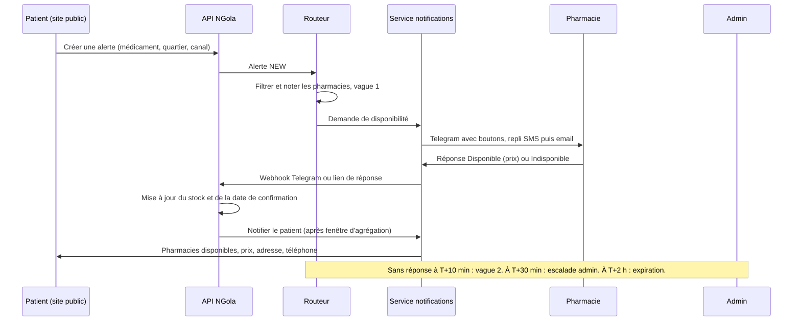
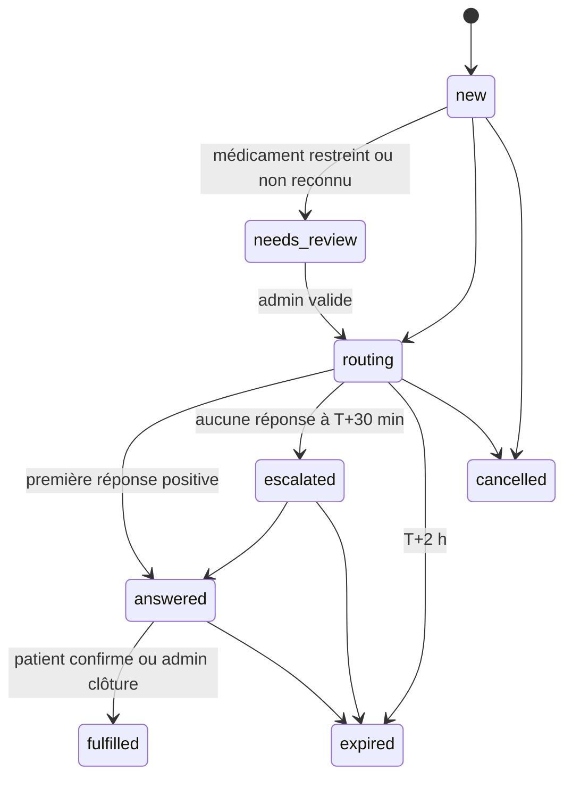

# SPEC 2 — Routage automatique des alertes de disponibilité

> **Destinataire : Claude Code.** Lire en entier avant de coder.
> Projet : N'Gola Pharma (Yaoundé). Spec liée : `SPEC-1-onboarding-pharmacies.md` (tables `pharmacy_contacts`, `drug_catalog`, `stock_items`).
>
> **Décisions du propriétaire intégrées (v2)**
> 1. Le canal de messagerie principal est **Telegram** (Bot API) à la place de WhatsApp : aucun template à faire approuver. Repli SMS puis email.
> 2. Les médicaments **restreints** (stupéfiants, psychotropes) ne sont **jamais routés automatiquement** ; leur liste initiale est **validée par un pharmacien** avant la mise en production du routage.
> 3. Les **ordonnances** sont présentées **en pharmacie, lors de l'achat ou du retrait** : la plateforme ne collecte, ne stocke ni ne vérifie aucune ordonnance.
> 4. **MVP et présentation aux pharmaciens** : on utilise le **catalogue de test** en **mode démo** (section 4.0bis). Le verrou de classification reste intact pour la production.

---

## 0. Consignes à Claude Code

1. **Inspecte d'abord le dépôt** (table d'alertes existante, API, Espace Pro, console admin). Stack supposée : frontend vanilla JS (Netlify), API Node/Express (Fly.io), Supabase (PostgreSQL, Auth, RLS). Adapte-toi au dépôt si différent.
2. **Le moteur de routage est une fonction pure** : `planDispatch(alert, pharmacies, config, now) → DispatchPlan`. Aucun accès réseau ni base dans cette fonction, pour qu'elle soit testable de manière exhaustive.
3. **Les envois passent par un outbox** (table + worker), jamais directement depuis un handler HTTP.
4. **Fournisseurs de messages derrière une interface** (`TelegramProvider`, `SmsProvider`, `EmailProvider`, une interface commune `ChannelProvider` pour pouvoir ajouter un canal plus tard) avec une implémentation `console/mock` par défaut en dev et en test. Aucun envoi réel hors production.
5. Toute règle chiffrée (délais, poids, seuils) vit dans `routing_config` (modifiable par l'admin), pas en dur dans le code.
6. Migrations SQL versionnées, rétro-compatibles. Feature flag `ALERT_AUTO_ROUTING` : désactivé = comportement actuel (dispatch manuel par l'admin).
7. Textes en français, clés i18n prêtes pour l'EN.

---

## 1. Contexte et objectif

**Aujourd'hui** : l'écran « Alertes » de l'Espace Pro est verrouillé (« visibles par les administrateurs ») ; l'admin dispatche à la main. C'est trop lent pour une demande urgente et ne tient pas au-delà de quelques dizaines de pharmacies.

**Cible** : l'admin **fixe les règles et supervise** ; le système route automatiquement ; chaque réponse d'une pharmacie **met aussi à jour son stock** (donnée fraîche gratuite).

**Principes**
- La pharmacie ne voit **jamais** l'identité du patient (demande anonymisée).
- Le patient n'est contacté qu'avec son consentement, par le canal qu'il a choisi.
- Pas de conseil médical, pas de substitution automatique de médicament.
- Les médicaments `restricted` (stupéfiants, psychotropes) ne sont **jamais** routés automatiquement (section 4.0).
- Les **ordonnances** ne transitent pas par la plateforme : elles sont présentées à la pharmacie au moment de l'achat ou du retrait. N'Gola Pharma informe seulement (« sur ordonnance »), sans collecte, sans vérification, sans statut « ordonnance validée ».

---

## 2. Flux global



### Cycle de vie d'une alerte



---

## 3. Création d'une alerte (côté patient)

- Entrée : médicament **choisi dans le catalogue** (autocomplétion nom + dosage + forme), quartier, urgence (`normal` | `urgent`), canal de retour.
- Texte libre non reconnu : l'alerte passe en `needs_review` (l'admin la rattache au catalogue ou la rejette ; **aucun texte libre n'est envoyé aux pharmacies**).
- **Canal de retour** (au choix du patient) :
  1. **Telegram via lien profond** (recommandé) : le bouton ouvre `https://t.me/<BOT_USERNAME>?start=<token>` ; le token est à usage unique et lié à l'alerte. Quand le patient appuie sur « Démarrer », le webhook reçoit `/start <token>`, enregistre le `chat_id` et le consentement, et le bot peut ensuite écrire librement (pas de template, pas de fenêtre de temps). Le routage commence dès la création de l'alerte, sans attendre cette étape.
  2. SMS (numéro saisi + case de consentement).
  3. Aucun canal : le patient reste sur la page de suivi `/alerte/:publicId` (rafraîchie toutes les 15 s).
- **Information ordonnance** : si le médicament a `requires_prescription=true`, la fiche et le formulaire affichent « Délivré sur ordonnance : à présenter à la pharmacie lors de l'achat ou du retrait ». Aucun champ d'envoi d'ordonnance, aucune case « j'ai une ordonnance » n'est demandée.
- **Médicament `restricted`** : message immédiat au patient (`restricted_attente`, section 7.2), l'alerte passe en `needs_review`.
- Anti-abus : captcha, **5 alertes par jour et par numéro/IP** (compteur sur hash), fusion si même patient + même médicament en moins de 30 minutes.
- Le numéro du patient est **chiffré** en base ; un **hash** sert au rate-limit ; jamais exposé aux pharmacies ni dans les logs.

---

## 4. Règles de routage

### 4.0 Garde-fou réglementaire (avant tout routage)
- Chaque entrée du catalogue porte `restricted`, `requires_prescription` et `classification_validated_at` (voir SPEC 1, section 6).
- **Routage automatique autorisé uniquement si** `restricted = false` **ET** `classification_validated_at` n'est pas nul (**exception encadrée : mode démo, 4.0bis**). Sinon l'alerte passe en `needs_review` (revue admin). Une classification absente est donc traitée comme « restreint » (comportement par défaut sûr).
- `requires_prescription = true` **n'empêche pas** le routage : le message aux pharmacies et au patient porte simplement la mention d'ordonnance (section 7).
- **Liste initiale des restreints** : fournie sous forme de fichier `seed/restricted_initial.csv`, **vide à la livraison**. **Claude Code ne doit pas la remplir de sa propre initiative** : elle est établie et validée par un pharmacien diplômé (nom, numéro d'Ordre, date) via l'écran admin « Classification du catalogue ». La validation crée un enregistrement dans `catalog_classification_validations` et renseigne `classification_validated_at` sur les lignes concernées. Toute modification ultérieure des indicateurs d'une ligne remet sa validation à zéro.
- **Verrou de production** : au démarrage, si `app_mode='production'`, `ALERT_AUTO_ROUTING=true` et qu'aucune validation pharmacien n'existe, l'application refuse d'activer le routage automatique et affiche une bannière dans la console admin.
- **Revue admin d'une alerte `needs_review`** : (a) rattacher à un médicament du catalogue, (b) transmettre manuellement à des pharmacies choisies (action tracée, avec le rappel d'ordonnance), ou (c) refuser avec le message `restricted_refus`.

### 4.0bis Mode démo (MVP et présentation aux pharmaciens)

Objectif : montrer le produit de bout en bout avec le **catalogue de test**, sans contourner le garde-fou réglementaire de la production.

- **Paramètre** `app_mode` dans `routing_config` : `demo` (défaut tant que le produit n'est pas lancé) ou `production`. Le passage à `production` est une action admin explicite, bloquée tant que les conditions du bloc « Passage en production » ci-dessous ne sont pas remplies.
- **Catalogue de démonstration** : les médicaments de test existants sont marqués `is_demo=true` (SPEC 1, 5bis) et chargés depuis `seed/demo_catalog.csv` (colonnes : `dci, brand_name, strength, form, pack_size, requires_prescription, restricted`).
  - **`restricted` est décidé par le propriétaire**, pas par Claude Code : `false` uniquement pour les médicaments qu'il confirme explicitement comme non restreints ; en cas de doute, `true`.
  - Claude Code peut **proposer** `requires_prescription` pour chaque médicament de test, marqué « proposition à confirmer ». Cette proposition sert uniquement à la démo.
  - Inclure **un médicament fictif « Exemple restreint (démo) »** avec `restricted=true`, pour montrer le garde-fou et la revue admin sans nommer de vrai stupéfiant ni psychotrope.
- **En mode démo, le routage automatique est autorisé** pour un médicament `is_demo=true`, `restricted=false`, même si `classification_validated_at` est nul. Tout médicament `restricted=true` reste bloqué, démo ou non.
- **Pharmacies de démonstration** : les 52 pharmacies de test sont marquées `is_demo=true` ; elles n'ont aucun contact réel.
- **Destinataires réels limités à une liste blanche** : en mode démo, un message n'est envoyé qu'à un contact marqué `is_demo_contact=true` (comptes Telegram de test : celui du propriétaire, ceux des pharmaciens qui participent à la présentation et ont activé le bot eux-mêmes). Pour tout autre destinataire, l'outbox enregistre le message avec le statut `suppressed_demo` (visible dans la console admin comme « aurait été envoyé »), sans appel au fournisseur. Cela vaut aussi pour les patients et pour les SMS/emails.
- **Bannière « MODE DÉMO — données fictives »** sur le site public, l'Espace Pro et la console admin ; les pharmacies de démonstration sont étiquetées « Données de démonstration » dans les résultats. Aucune promesse de disponibilité réelle n'est affichée.
- **Aucun vrai justificatif en démo** : les formulaires de pré-inscription affichent « N'envoyez pas de documents réels en mode démo ».
- **Passage en production** (`app_mode='production'`) uniquement si : (a) une validation pharmacien existe pour le catalogue de production (4.0), (b) aucune ligne `is_demo=true` n'est routable ni visible publiquement (purge ou archivage), (c) au moins une pharmacie réelle est `verifie`, (d) le fournisseur Telegram réel est configuré. La console admin affiche cette liste de contrôle.
- **Opportunité à la présentation** : la session avec les pharmaciens sert aussi à recueillir leur avis sur la classification du catalogue de test et à identifier le pharmacien validateur.

**Scénario de démonstration à rendre rejouable** (script `scripts/demo-reset.js` qui remet les données de démo à zéro) :
1. Un patient demande un médicament non restreint (par exemple Ibuprofène 400mg à Centre-Ville) ; le téléphone d'un pharmacien participant reçoit la demande sur Telegram ; il répond « Disponible » ; le stock et la date se mettent à jour ; le patient reçoit le message avec la mention d'ordonnance si besoin.
2. Une demande sans réponse déclenche la vague 2, puis l'escalade (accélérée par un paramètre `demo_time_factor`, par exemple ×10).
3. Une demande sur « Exemple restreint (démo) » part en revue admin avec le message d'attente au patient.
4. Un message `suppressed_demo` s'affiche pour une pharmacie non participante.

### 4.1 Filtres éliminatoires (une pharmacie doit les respecter toutes)
1. `verification_status='verifie'`, `is_published=true`, non suspendue.
2. Au moins un contact actif (`pharmacy_contacts` : opt-in, non désabonné).
3. **Ouverte maintenant**, ou **de garde** (si l'alerte arrive hors horaires, seules les pharmacies de garde sont éligibles).
4. Pas en **cooldown** : maximum `max_dispatch_per_hour` (défaut 6) demandes par heure.
5. Stock : si une ligne `out` confirmée il y a moins de `out_fresh_days` (défaut 3 jours) existe pour ce médicament, la pharmacie est exclue. Une ligne `out` plus ancienne ne l'exclut pas (elle sera « à confirmer »).

### 4.2 Score (0 à 100, poids dans `routing_config`)

| Critère | Points |
|---|---|
| Stock `in_stock` confirmé ≤ 3 j | +40 |
| Stock `in_stock` confirmé 4 à 7 j | +30 |
| Aucun enregistrement pour ce médicament | +15 |
| Stock périmé (> 7 j) | +10 |
| Même quartier que le patient | +30 |
| Quartier adjacent (ou distance ≤ 3 km si GPS) | +15 |
| Autre | +5 |
| Taux de réponse des 30 derniers jours × 20 (défaut 0,5 pour une nouvelle pharmacie) | 0 à +20 |
| De garde, alerte hors horaires | +10 |
| Équité : −5 par demande reçue dans l'heure au-delà de 3 | négatif |

Départage : la pharmacie la moins récemment sollicitée.

### 4.3 Vagues
- **Vague 1 (T+0)** : top `wave1_size` (défaut **3**).
- **Vague 2 (T+10 min)** si aucune réponse positive : `wave2_size` suivantes (défaut **5**), rayon élargi.
- **Escalade (T+30 min)** : notification à l'admin (canal interne), message d'attente au patient (« recherche en cours »).
- **Expiration (T+2 h)** : message au patient avec le lien vers la liste des pharmacies de garde.
- **Urgence `urgent`** : délais divisés par deux.

### 4.4 Agrégation des réponses positives
À la première réponse positive, ouvrir une **fenêtre de 120 s** (`aggregation_window_s`) ; à la fermeture, envoyer **un seul message** au patient avec jusqu'à 3 pharmacies classées (prix croissant puis distance). Une réponse arrivant plus tard (avant expiration) génère un second message court, plafonné à 1.

### 4.5 Règles d'équité et de traçabilité
- Toute décision du routeur (candidats, score, exclus + raison) est enregistrée dans `alert_dispatches.score_detail` (jsonb) pour audit et réglage.
- L'admin peut : ajouter une pharmacie manuellement à une alerte, retirer un destinataire, relancer une vague, clôturer, bloquer un patient (hash).

---

## 5. Réponse d'une pharmacie

**Trois façons de répondre (toutes idempotentes, une seule réponse comptée par envoi)**
1. **Boutons Telegram** (clavier en ligne sous le message) : `✅ Disponible`, `❌ Indisponible`, et un bouton lien « Préciser le prix ». Après le clic, le bot appelle `answerCallbackQuery`, puis `editMessageText` pour retirer les boutons et afficher « Réponse enregistrée à HH:MM » (évite le double clic).
2. **Lien de réponse en un tap** (SMS et email) : `https://ngola-pharma.com/r/<code>` ; page sans connexion, deux gros boutons, prix pré-rempli depuis le stock. Jeton signé (HMAC) à usage limité, valable jusqu'à l'expiration de l'alerte.
3. **Espace Pro → Alertes** : liste des demandes en attente (remplace l'écran verrouillé), mêmes boutons.

**Effets d'une réponse**
- `Disponible` : `stock_items` → `in_stock`, `last_confirmed_at = now()`, prix mis à jour si saisi ; ligne créée si le produit n'existait pas.
- `Indisponible` : `stock_items` → `out`, `last_confirmed_at = now()`.
- Sans réponse après 2 vagues : compteur « non répondu » (alimente le taux de réponse), sans pénalité sur le stock.
- **Sécurité** : une réponse Telegram n'est acceptée que si (a) l'appel au webhook porte l'en-tête secret `X-Telegram-Bot-Api-Secret-Token`, (b) le `chat_id` de l'expéditeur correspond à un `pharmacy_contacts` vérifié de la pharmacie destinataire, (c) le `callback_data` (≤ 64 octets, format `r:<dispatch_short_id>:a|u`) référence un dispatch valide et non expiré. Sinon : ignorée et journalisée.
- **Plusieurs agents par pharmacie** : jusqu'à 3 contacts Telegram vérifiés par pharmacie (`max_telegram_contacts_per_pharmacy`). Tous reçoivent la demande ; **la première réponse l'emporte** et les messages des autres sont mis à jour (« Déjà traitée par un collègue »).

---

## 6. Canaux et repli (pharmacies)

| Ordre | Canal | Usage |
|---|---|---|
| 1 | **Telegram** (bot N'Gola Pharma, chat privé) | Canal principal, gratuit |
| 2 | **SMS** | Repli si Telegram est indisponible ou inactif, et relance des alertes `urgent` |
| 3 | **Email** | Systématique pour l'escalade et le résumé quotidien ; repli final |
| Toujours | **Espace Pro** (onglet Alertes + pastille) | Source de vérité, réponse possible |

### 6.1 Particularités de Telegram à respecter
- **Un bot ne peut écrire qu'à une personne qui l'a démarré.** L'activation se fait par lien profond personnel `https://t.me/<BOT_USERNAME>?start=<token>` (affiché en lien et en QR code dans l'Espace Pro). Le jeton est à usage unique, valable 72 h, stocké haché (`telegram_link_tokens`). À la réception de `/start <token>`, le `chat_id` est enregistré dans `pharmacy_contacts` (`channel='telegram'`, `verified_at=now()`), et le bot envoie `telegram_activation`.
- **Pas de template à approuver, pas de fenêtre de conversation** : texte libre (mode HTML), emojis autorisés.
- **Pas d'accusé de livraison ni de lecture.** Un appel `sendMessage` réussi signifie « accepté par Telegram », pas « lu ». Conséquences :
  - erreur API (403 bot bloqué ou utilisateur désactivé, 400 chat introuvable) → contact marqué `blocked`, **bascule immédiate vers SMS** ;
  - alerte `urgent` sans réponse après `sms_nudge_after_min` (défaut **5 min**) → **SMS de relance** à la même pharmacie ;
  - alerte `normal` : pas de relance, on s'appuie sur les vagues (4.3).
- **Limites de débit** : environ 30 messages/s pour l'ensemble du bot et 1 message/s par chat. Le worker plafonne à 20 msg/s au total et 1 msg/s par chat, et respecte `retry_after` des réponses 429.
- **Webhook** : `setWebhook` avec `secret_token` ; `allowed_updates = ["message","callback_query"]` ; vérifier l'en-tête `X-Telegram-Bot-Api-Secret-Token` ; répondre 200 rapidement et traiter en tâche de fond.
- **Commandes du bot** : `/start`, `/stop` (désabonnement), `/aide`. Pas de groupes ni de canaux : **chats privés uniquement** (aucune donnée de demande dans un espace partagé).
- **Bot existant** : le dépôt contient peut-être un prototype Python (données fictives, hébergé sur Replit). **Ne pas le réutiliser en production** : le bot doit vivre dans l'API Node (même base, même webhook) ; le prototype peut servir d'inspiration pour les libellés.

### 6.2 Règles générales
- Chaque envoi a une `idempotency_key` (`dispatch_id:channel:template`) pour éviter les doublons après un retry.
- Retry : 3 tentatives (30 s / 2 min / 5 min), puis canal suivant.
- **Désabonnement** : `/stop` (Telegram), « STOP » (SMS) ou lien email → `opted_out_at` ; les alertes restent visibles dans l'Espace Pro.
- Heures calmes : aucune pour les pharmacies de garde ; sinon envoi limité aux horaires d'ouverture déclarés (garanti par le filtre 4.1).
- **Coût** : Telegram est gratuit ; seuls les SMS et les emails sont comptés. `cost_estimate` par message et `daily_message_budget` (alerte admin à 80 %, plus de SMS de relance au-delà de 100 %, hors alertes `urgent` des pharmacies de garde).
- **Risque d'adoption à surveiller** : Telegram est probablement moins répandu que WhatsApp chez les pharmaciens et les patients de Yaoundé. Mesurer le taux d'activation (section 10) et conserver SMS + Espace Pro comme filets de sécurité. L'interface `ChannelProvider` permet d'ajouter WhatsApp plus tard sans toucher au moteur de routage.

---

## 7. Messages

> Telegram : pas de template à faire approuver. Les textes ci-dessous sont envoyés en mode HTML (`<b>` pour le gras). Les variables entre `{{ }}` sont remplacées côté serveur et **échappées** (caractères `< > &`). Ne jamais inclure de donnée personnelle du patient.

### 7.1 Vers les pharmacies

**Telegram — `alerte_demande`**
```
🔔 <b>N'Gola Pharma — Demande d'un patient</b>
Médicament : <b>{{drug}}</b> ({{form}})
Quartier : {{quartier}}
Reçue à {{heure}}
{{ordonnance_pharmacie}}
Avez-vous ce médicament en stock maintenant ?
```
- `{{ordonnance_pharmacie}}` = `📋 Médicament sur ordonnance : à présenter au comptoir lors de l'achat ou du retrait.` si `requires_prescription`, sinon ligne vide (supprimée).
- Clavier en ligne : `[✅ Disponible]` `[❌ Indisponible]` ; deuxième ligne : `[💰 Préciser le prix]` (bouton lien vers `/r/{{code}}`).
- Après réponse, le message est modifié en : `✅ Réponse enregistrée à {{heure}} : {{reponse}}. Merci !`
- Si un collègue a déjà répondu : `ℹ️ Déjà traitée par un collègue à {{heure}}.`

**Telegram — `telegram_activation`**
```
Bienvenue sur N'Gola Pharma, {{nom}} 👋
Ce compte Telegram recevra les demandes de patients pour {{pharmacie}}.
Envoyez /stop à tout moment pour ne plus les recevoir.
```

**Telegram — `rappel_confirmation_stock`**
```
Bonjour {{nom}}, vos stocks N'Gola Pharma datent de {{jours}} jours.
Confirmez-les en un clic.
```
Bouton lien : `[Confirmer mes stocks]` → `/c/{{token}}` (jeton signé à usage unique, valable 24 h).

**SMS — `alerte_demande_sms`** (≤ 160 caractères, **sans accents ni emojis**, sinon encodage UCS-2 = 70 caractères par segment ; le worker tronque les noms trop longs)
```
NGola: demande patient {{drug}} a {{quartier}}. Dispo? Repondez: ngola-pharma.com/r/{{code}}
```

**Email — `alerte_demande_email`**
- Objet : `Demande patient : {{drug}} à {{quartier}}`
- Corps : `Bonjour, un patient recherche {{drug}} dans le quartier {{quartier}} (demande reçue à {{heure}}). {{ordonnance_pharmacie}} Merci de confirmer la disponibilité : [Disponible] [Indisponible]. Ces boutons mettent aussi à jour vos stocks.` + pied de page de désabonnement.

### 7.2 Vers le patient

**Telegram — `reponse_patient`** (texte libre, après la fenêtre d'agrégation)
```
✅ <b>{{drug}}</b> est disponible :
1) {{pharmacie1}} — {{prix1}} FCFA — {{quartier1}} — Tél {{tel1}}
2) {{pharmacie2}} — {{prix2}} FCFA — {{quartier2}} — Tél {{tel2}}
Prix confirmés par les pharmacies à {{heure}}. Appelez avant de vous déplacer.
{{ordonnance_patient}}
```
- `{{ordonnance_patient}}` = `📋 Ce médicament est délivré sur ordonnance : présentez-la à la pharmacie lors de l'achat ou du retrait.` si `requires_prescription`, sinon supprimée.

**SMS — `reponse_patient_sms`** (sans accents)
```
NGola: {{drug}} dispo chez {{pharmacie}} ({{quartier}}) env. {{prix}} FCFA. Tel {{tel}}. {{ordo_sms}}Appelez avant de vous deplacer.
```
`{{ordo_sms}}` = `Ordonnance a presenter sur place. ` si `requires_prescription`.

**Attente (T+30 min)** : `Nous cherchons encore {{drug}} près de vous. Nous revenons vers vous dès qu'une pharmacie confirme.`

**Expiration (T+2 h)** : `Aucune pharmacie n'a confirmé {{drug}} pour le moment. Pharmacies de garde : ngola-pharma.com/garde`

**Restreint, en attente (`restricted_attente`)** : `Ce médicament est soumis à une réglementation stricte. Votre demande sera examinée par notre équipe avant toute transmission. En cas d'urgence, rendez-vous directement dans une pharmacie de garde : ngola-pharma.com/garde`

**Restreint, refus (`restricted_refus`)** : `Ce médicament ne peut pas être recherché via N'Gola Pharma. Rapprochez-vous directement d'une pharmacie, avec votre ordonnance. Pharmacies de garde : ngola-pharma.com/garde`

**Règles communes** : ne jamais inclure de conseil médical, de posologie ni de substitution ; toujours mentionner l'heure de confirmation ; ne jamais exposer l'identifiant interne du patient ; ne jamais demander ni accepter d'ordonnance (photo, scan, numéro).

### 7.3 Vers l'admin (escalade)
Email + notification dans la console : `Alerte {{id}} sans réponse depuis 30 min — {{drug}} à {{quartier}} — {{n}} pharmacies sollicitées. [Ouvrir]`

---

## 8. Modèle de données

```sql
create table routing_config (
  key text primary key, value jsonb not null,
  updated_by uuid, updated_at timestamptz not null default now()
);
-- Valeurs initiales : wave1_size=3, wave2_size=5, wave2_delay_min=10, escalate_min=30,
-- expire_min=120, aggregation_window_s=120, max_dispatch_per_hour=6, out_fresh_days=3,
-- score_weights={...}, daily_message_budget=..., urgent_delay_factor=0.5,
-- sms_nudge_after_min=5, max_telegram_contacts_per_pharmacy=3,
-- app_mode='demo', demo_time_factor=1 (utile seulement pour accélérer les délais en présentation)

create table alerts (
  id uuid primary key default gen_random_uuid(),
  public_id text unique not null,                 -- affiché au patient
  catalog_id uuid references drug_catalog(id),
  raw_query text,                                 -- si non reconnu (jamais envoyé aux pharmacies)
  quartier_id uuid not null,
  lat numeric(9,6), lng numeric(9,6),
  urgency text not null default 'normal' check (urgency in ('normal','urgent')),
  status text not null default 'new'
    check (status in ('new','needs_review','routing','answered','escalated','fulfilled','expired','cancelled')),
  patient_channel text check (patient_channel in ('telegram','sms','none')),
  patient_contact_enc bytea,                      -- chiffré (chat_id Telegram ou numéro SMS)
  patient_hash text not null,                     -- rate-limit, anti-abus
  consent_at timestamptz,
  wave int not null default 0,
  first_positive_at timestamptz,
  created_at timestamptz not null default now(),
  expires_at timestamptz not null
);

create table alert_dispatches (
  id uuid primary key default gen_random_uuid(),
  alert_id uuid not null references alerts(id) on delete cascade,
  pharmacy_id uuid not null references pharmacies(id),
  wave int not null,
  score numeric(5,2) not null,
  score_detail jsonb not null,                    -- pourquoi cette pharmacie
  response_code text unique not null,             -- code court du lien /r/<code>
  status text not null default 'sent'
    check (status in ('sent','responded','expired','cancelled')),
  sent_at timestamptz not null default now(),
  unique (alert_id, pharmacy_id)
);

create table alert_responses (
  id uuid primary key default gen_random_uuid(),
  dispatch_id uuid not null unique references alert_dispatches(id) on delete cascade,
  answer text not null check (answer in ('available','unavailable')),
  price_fcfa integer check (price_fcfa > 0),
  via text not null check (via in ('telegram','link','dashboard','admin')),
  responded_at timestamptz not null default now()
);

create table notification_outbox (
  id uuid primary key default gen_random_uuid(),
  idempotency_key text unique not null,
  recipient_type text not null check (recipient_type in ('pharmacy','patient','admin')),
  recipient_ref uuid,
  channel text not null check (channel in ('telegram','sms','email')),
  template_key text not null,
  to_address_enc bytea not null,
  vars jsonb not null default '{}',
  status text not null default 'queued'
    check (status in ('queued','sent','delivered','read','failed','cancelled','suppressed_demo')),
  provider_msg_id text, provider_chat_id text,   -- pour editMessageText (Telegram)
  attempts int not null default 0,
  next_attempt_at timestamptz not null default now(),
  last_error text, cost_estimate numeric(8,4),
  created_at timestamptz not null default now(), updated_at timestamptz not null default now()
);
create index on notification_outbox (status, next_attempt_at);

create table telegram_link_tokens (
  token_hash text primary key,                    -- jamais le jeton en clair
  purpose text not null check (purpose in ('pharmacy_contact','patient_alert')),
  ref_id uuid not null,                           -- pharmacy_contacts.id ou alerts.id
  expires_at timestamptz not null, used_at timestamptz
);

create table catalog_classification_validations (
  id uuid primary key default gen_random_uuid(),
  validated_by_name text not null,
  order_number text not null,                     -- n° d'Ordre du pharmacien validateur
  validated_at timestamptz not null default now(),
  scope jsonb not null,                           -- ids du catalogue concernés + valeurs validées
  document_ref text
);

create table patient_blocklist (patient_hash text primary key, reason text, created_at timestamptz default now());
```

**Worker** : processus dédié (ou second process Fly.io) qui prélève par lots avec `FOR UPDATE SKIP LOCKED`, envoie via le fournisseur, applique back-off et repli de canal, met à jour les statuts via les webhooks de livraison.

**Planificateur** : tâche toutes les 30 s qui (a) déclenche la vague 2, l'escalade et l'expiration selon `routing_config`, (b) ferme les fenêtres d'agrégation et envoie le message patient.

**RLS**
- `alert_dispatches` / `alert_responses` : une pharmacie ne voit que ses propres dispatches, **sans** aucune colonne patient.
- `alerts` : jamais lisible par les rôles pharmacie (vue dédiée `pharmacy_alert_view` : médicament, quartier, heure, urgence).
- `patient_contact_enc`, `notification_outbox` : serveur uniquement (service role).
- `routing_config`, blocklist, `catalog_classification_validations` : admin.

---

## 9. API

| Méthode | Route | Accès |
|---|---|---|
| POST | `/api/alerts` | Public (captcha, rate limit) |
| GET | `/api/alerts/:publicId` | Public (état de suivi, sans données de pharmacie tant que non répondu) |
| POST | `/api/webhooks/telegram` | Telegram (en-tête `X-Telegram-Bot-Api-Secret-Token`) |
| POST | `/api/webhooks/sms-status` | Fournisseur |
| GET/POST | `/r/:code` | Lien de réponse (jeton signé) |
| GET/POST | `/c/:token` | Lien « Confirmer mes stocks » (jeton signé, usage unique) |
| GET | `/api/pro/alerts` | Pharmacie (vue anonymisée) |
| POST | `/api/pro/alerts/:dispatchId/respond` | Pharmacie |
| GET | `/api/admin/alerts` | Admin (liste, chronologie) |
| POST | `/api/admin/alerts/:id/{dispatch,cancel,close,reroute,approve}` | Admin |
| GET/PUT | `/api/admin/routing-config` | Admin |
| GET/POST | `/api/admin/catalog/classification` | Admin (validation pharmacien, section 4.0) |
| GET | `/api/admin/alerts/metrics` | Admin |

---

## 10. Interfaces

**Espace Pro → Alertes** (remplace l'écran verrouillé) : liste des demandes en attente (médicament, quartier, âge de la demande), boutons `Disponible` (prix pré-rempli) / `Indisponible`, historique, temps de réponse moyen, et réglage des canaux (activation Telegram par lien et QR code, numéros SMS, test d'envoi, désabonnement).

**Console admin → Alertes** : file en temps réel, chronologie par alerte (vagues, destinataires, réponses, coûts), actions manuelles (section 4.5), panneau de réglage de `routing_config`, tableau de bord des indicateurs.

**Indicateurs** : délai médian jusqu'à la première réponse positive ; part d'alertes avec réponse positive sous 15 min ; taux de réponse par pharmacie ; taux d'activation Telegram par pharmacie ; taux d'échec et de repli SMS ; coût moyen par alerte ; nombre de mises à jour de stock issues des alertes.

---

## 11. Vie privée et conformité

- Consentement du patient horodaté (`consent_at`) ; minimisation : seuls médicament, quartier et heure vont aux pharmacies.
- Contact du patient (numéro SMS ou `chat_id` Telegram) : chiffré, purgé **30 jours** après clôture (config) ; hash conservé pour l'anti-abus.
- **Aucune ordonnance** n'est collectée ni stockée (ni photo, ni scan, ni numéro) ; les messages sont conçus pour ne pas en provoquer l'envoi.
- Opt-out patient et pharmacie respecté sur tous les canaux (`/stop` sur Telegram).
- Journal d'audit des accès admin aux données patient.
- La conformité à la législation camerounaise sur la protection des données personnelles est **à valider par un conseil juridique local** avant le lancement public.

---

## 12. Ordre de livraison conseillé

1. **PR 1** — Migrations (section 8) + `routing_config` initial + colonnes de classification du catalogue (SPEC 1) + écran admin « Classification du catalogue » et verrou de production (4.0).
2. **PR 2** — Interfaces de fournisseurs + fournisseur `mock`, outbox + worker (retry, repli de canal, idempotence).
3. **PR 3** — Moteur `planDispatch` (fonction pure) + tests unitaires complets.
4. **PR 4** — Création d'alerte (public) + file `needs_review` + planificateur (vagues, escalade, expiration, agrégation).
5. **PR 5** — Réponses : webhook Telegram, lien `/r/:code`, onglet Espace Pro, mise à jour des stocks.
6. **PR 6** — Console admin (supervision, actions manuelles, réglages, indicateurs).
6bis. **PR 6bis (priorité pour la présentation)** — Mode démo (4.0bis) : `app_mode`, bannières, liste blanche `is_demo_contact`, statut `suppressed_demo`, `seed/demo_catalog.csv`, `scripts/demo-reset.js`. Avec le fournisseur Telegram réel limité à la liste blanche, la démonstration peut avoir lieu **avant** les PR de production.
7. **PR 7** — Vrais fournisseurs : bot Telegram (création via @BotFather, `setWebhook` avec `secret_token`), SMS, email ; passage en production derrière `ALERT_AUTO_ROUTING`, **uniquement après la validation pharmacien de la classification**.

**Variables d'environnement** (liste indicative) : `APP_BASE_URL`, `SIGNING_SECRET`, `ENCRYPTION_KEY`, `TELEGRAM_BOT_TOKEN`, `TELEGRAM_BOT_USERNAME`, `TELEGRAM_WEBHOOK_SECRET`, `SMS_PROVIDER`, `SMS_API_KEY`, `EMAIL_PROVIDER`, `EMAIL_API_KEY`, `CAPTCHA_SECRET`, `ALERT_AUTO_ROUTING`.

---

## 13. Tests et critères d'acceptation

**Moteur (unitaires)**
- [ ] Une pharmacie fermée et non de garde est exclue ; de garde à 23 h, elle est incluse.
- [ ] Une pharmacie avec `out` confirmé il y a 1 jour est exclue ; avec `out` il y a 5 jours, elle est incluse comme « à confirmer ».
- [ ] Une pharmacie à 6 demandes dans l'heure est en cooldown.
- [ ] À stock égal, la pharmacie du même quartier passe devant celle d'un autre quartier.
- [ ] Un médicament `restricted` n'est jamais routé automatiquement.
- [ ] Un médicament dont `classification_validated_at` est nul n'est jamais routé automatiquement.
- [ ] Un médicament `requires_prescription=true` et non restreint est routé, et la mention d'ordonnance figure dans le message pharmacie et dans le message patient.
- [ ] Avec `ALERT_AUTO_ROUTING=true` et sans validation pharmacien, le routage automatique refuse de démarrer.
- [ ] Le même jeu de données en entrée donne toujours le même plan (déterminisme, départage compris).

**Mode démo**
- [ ] En `demo`, une alerte sur un médicament de test non restreint est routée sans validation pharmacien ; sur « Exemple restreint (démo) », elle passe en `needs_review`.
- [ ] En `demo`, un message vers un contact non marqué `is_demo_contact` n'est jamais envoyé au fournisseur : statut `suppressed_demo`.
- [ ] Le passage à `production` est refusé tant que les 4 conditions de 4.0bis ne sont pas remplies.
- [ ] `scripts/demo-reset.js` remet les données de démonstration dans un état identique à chaque exécution.

**Intégration**
- [ ] Sans réponse à T+10 min, la vague 2 part ; à T+30 min, l'admin est notifié ; à T+2 h, l'alerte expire et le patient est informé.
- [ ] Deux réponses positives dans la fenêtre de 120 s produisent **un seul** message patient avec deux pharmacies.
- [ ] Une réponse « Disponible » met à jour `last_confirmed_at` et le prix du stock ; une réponse rejouée ne duplique rien.
- [ ] Un appel au webhook Telegram sans le bon `secret_token` est rejeté ; un `chat_id` inconnu est ignoré et journalisé.
- [ ] `/start <token>` valide lie le `chat_id` au contact de la pharmacie ; le même jeton rejoué est refusé ; un jeton expiré est refusé.
- [ ] Deux agents d'une même pharmacie reçoivent la demande ; la première réponse l'emporte et le message du second est mis à jour.
- [ ] Un échec Telegram (403 bot bloqué) déclenche immédiatement le SMS ; pas de double envoi après retry (idempotence).
- [ ] Alerte `urgent` sans réponse à 5 min : un SMS de relance part ; alerte `normal` : aucun SMS de relance.
- [ ] Le message d'un patient contenant une photo ou un document est ignoré par le bot, qui répond qu'aucune ordonnance n'est à envoyer.
- [ ] Une pharmacie ne voit jamais le numéro ni l'identifiant du patient (test RLS et test de la vue anonymisée).
- [ ] 6 alertes le même jour depuis le même numéro : la 6e est refusée.
- [ ] Après `/stop` (Telegram) ou « STOP » (SMS), plus aucun message vers ce contact, mais l'alerte reste visible dans l'Espace Pro.

## 14. Décisions prises et points restants

**Décisions du propriétaire (intégrées dans cette version)**
1. Canal principal : Telegram (remplace WhatsApp), repli SMS puis email.
2. Médicaments restreints : jamais routés automatiquement ; liste initiale validée par un pharmacien.
3. Ordonnances : présentées en pharmacie lors de l'achat ou du retrait ; la plateforme n'intervient pas.

**Points restants**
1. Qui, parmi les pharmaciens présents à la présentation, accepte de recevoir les messages de test sur son Telegram (liste blanche) ?
2. Fenêtre d'agrégation de 120 s : acceptable pour les cas urgents, ou 30 s en mode `urgent` ?
3. Budget quotidien de SMS et fournisseur SMS (couverture opérateurs au Cameroun ; la réception de SMS entrants n'est pas requise grâce au lien de réponse).
4. Qui est le pharmacien validateur de la classification, et à quelle fréquence est-elle revue (proposition : à chaque ajout au catalogue + revue trimestrielle) ?
5. Le patient doit-il pouvoir confirmer « j'ai trouvé » (clôture `fulfilled`) pour mesurer la conversion ?
5bis. Plan B si l'activation Telegram des pharmacies reste faible (objectif à fixer, par exemple 80 % des pharmacies publiées) : relance par l'admin, aide à l'installation, ou ajout de WhatsApp via `ChannelProvider`.
